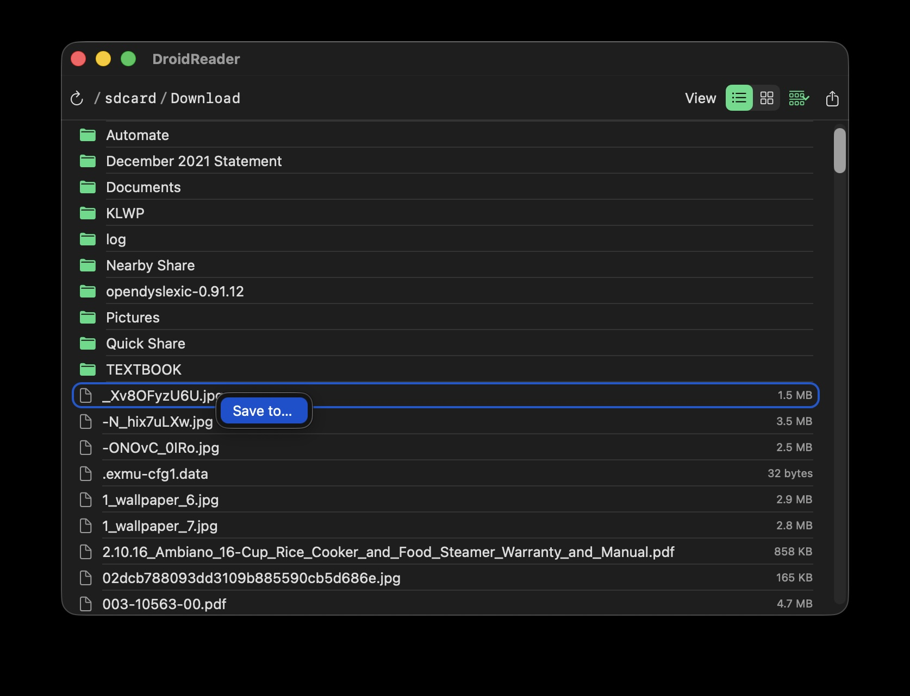
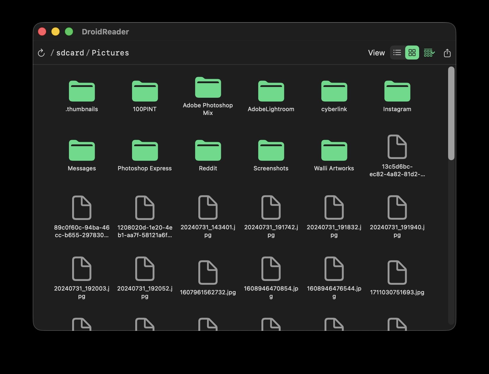
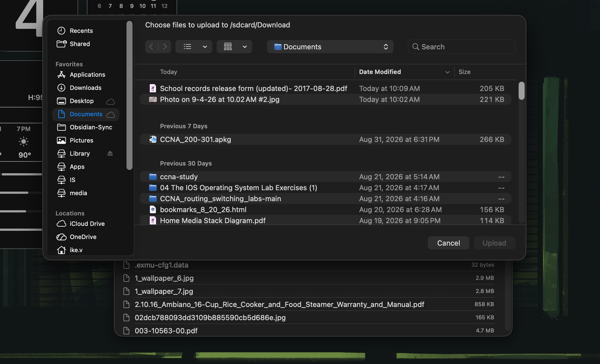
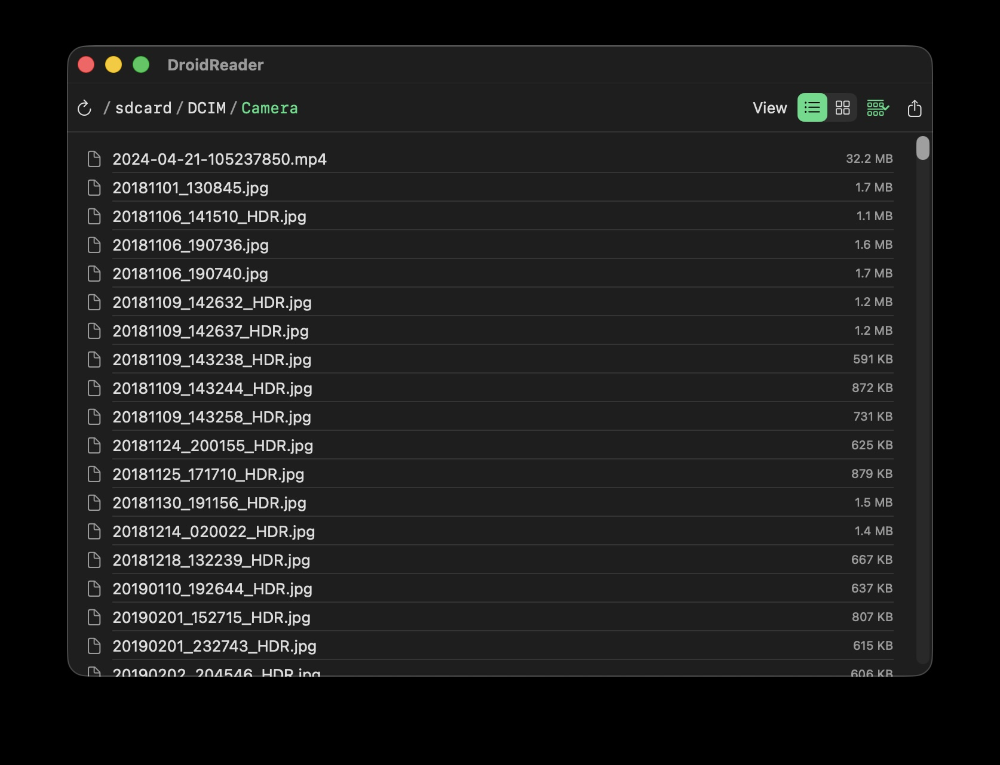

# DroidReader

A native macOS app for browsing your Android phone's storage over USB — no MTP, no kernel extension, no background daemon.



## What is this?

macOS has no built-in way to see an Android phone's files when you plug it in over USB. Every existing solution wraps `libmtp` in a FUSE filesystem, which means a kernel extension, kernel-level trust, and (in practice) a lot of flakiness getting it to actually mount. DroidReader takes a different path: it speaks Android's own USB debugging protocol (ADB) directly over a socket to the local `adb` server — the same mechanism Android Studio's Device File Explorer uses — reimplemented from scratch in Swift. No `adb` binary shelled out to, no third-party libraries, no elevated privileges, no daemons running in the background.

## Features

- Browse your phone's storage like a Finder window — List and Icon/Grid view, with sortable Group By (Name / Size / Date Modified)
- Double-click a file to pull it and open it in whatever app macOS would normally use for that file type
- Right-click → **Save to…** to copy a file to a folder you choose, without opening it
- **Upload** (↑) button to push local files onto the phone
- Click any segment of the path breadcrumb to jump straight to that folder
- **Refresh** (↻) button to reconnect after unplugging/replugging your phone — no need to relaunch

### Screenshots

| Grid view | Upload | Path breadcrumb |
| --- | --- | --- |
|  |  |  |

## Requirements

- macOS 13 (Ventura) or later
- Xcode Command Line Tools (for the Swift compiler — full Xcode isn't required): `xcode-select --install`
- An Android phone with **USB debugging** enabled: Settings → About phone → tap "Build number" 7 times to unlock Developer options → Developer options → USB debugging
- The `adb` server running on your Mac — easiest way is Homebrew: `brew install android-platform-tools`. DroidReader talks to this same background server; it just doesn't shell out to the `adb` binary itself.

## Getting started

```bash
git clone <repo-url>
cd DroidReader
./build.sh
open DroidReader.app
```

Plug in your phone before or after launching — the first time, you'll get a prompt on the phone itself asking to authorize this computer for USB debugging; accept it (check "always allow" to skip this next time). If you unplug/replug while the app is already open, hit the refresh (↻) button in the toolbar rather than relaunching.

## Notes

- This is a personal project, built and tested against one Samsung Galaxy Z Flip 5. It should work with any Android device with USB debugging enabled, but hasn't been tested more broadly.
- `build.sh` ad-hoc code-signs the app — enough to run it on your own Mac, not enough to hand it to someone else's (their Mac will flag it as from an unidentified developer).
- File access is scoped to whatever the `adb` shell user can already reach (typically `/sdcard` and its subdirectories) — the same scope as `adb shell`/`adb pull`/`adb push` from the command line.

## License

[MIT](LICENSE)
