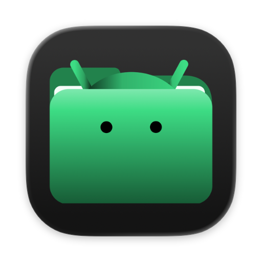
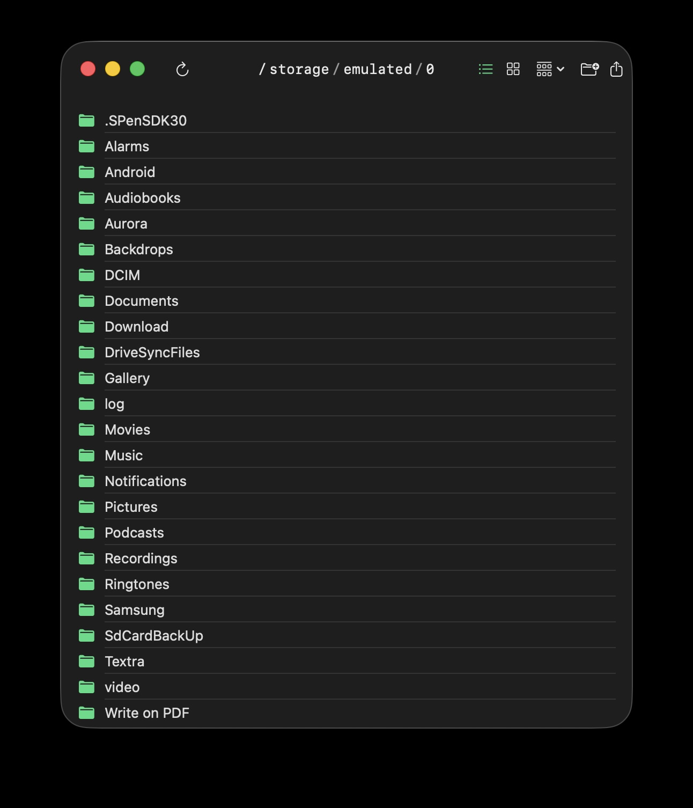
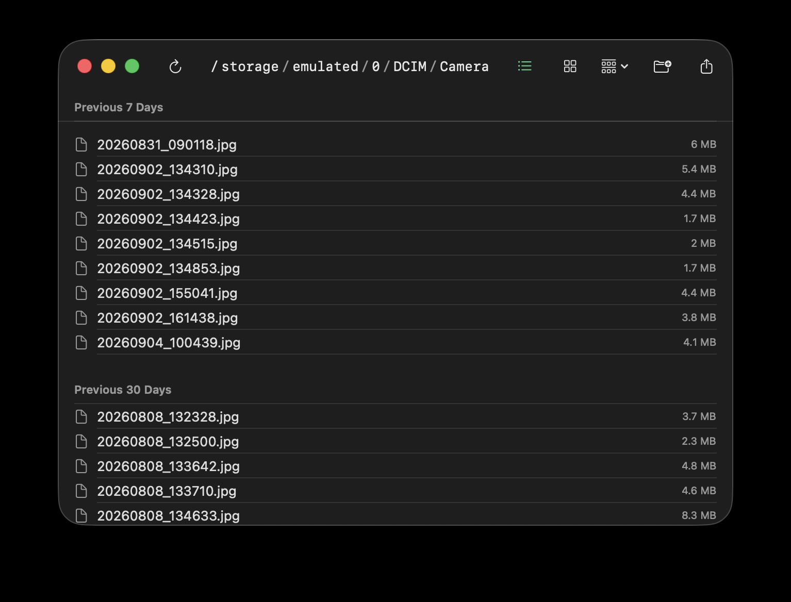
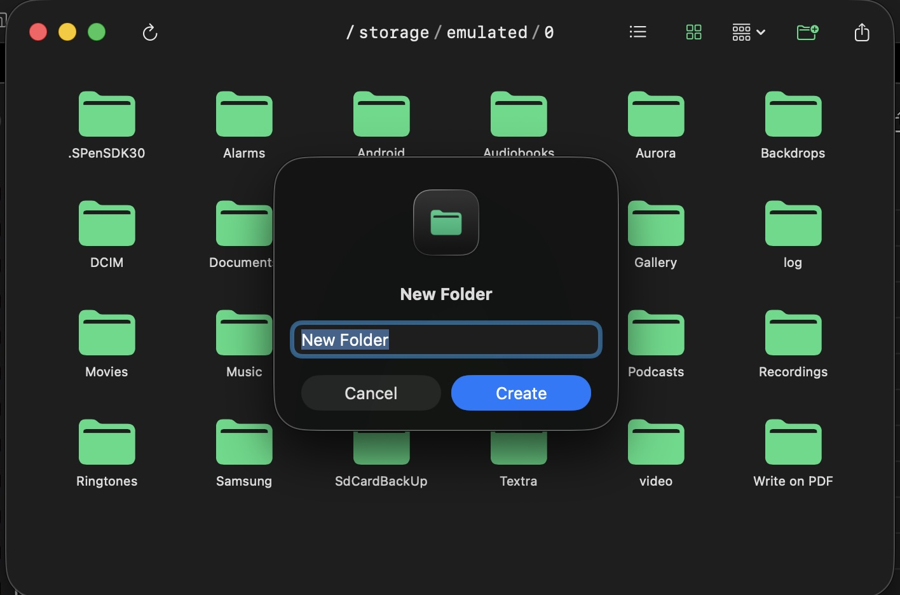
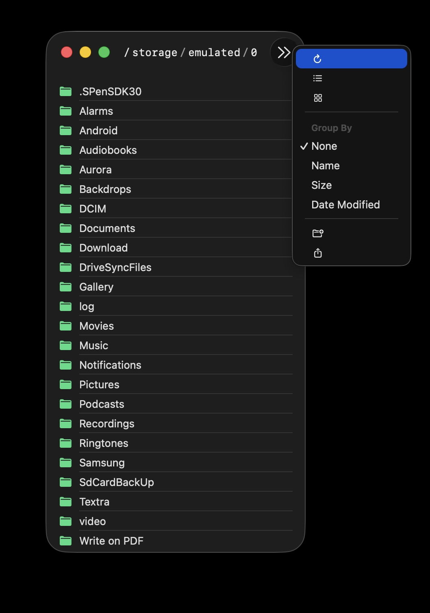

# Diroid



A native macOS app for browsing your Android phone's storage over USB
- no MTP
- no kernel extension
- no background daemon



## What is this?

- macOS has no built-in way to see an Android phone's files when you plug it in over USB. 
Every existing solution wraps `libmtp` in a FUSE filesystem, which means a kernel extension, kernel-level trust, and (in practice) a lot of flakiness getting it to actually mount.
- Diroid uses Android's USB debugging protocol (ADB) directly to the local `adb` server the same way Android Studio's "Device File Explorer" does but reimplemented from scratch in Swift.
- No `adb` binary shelled out to, no third-party libraries, no elevated privileges, no daemons running in the background.

## Features

- Browse your phone's storage like a Finder window.
- List and Grid view groupable by Name, Size, or Date Modified
- Double-click a file to pull it and open it in the default app macOS would use for that file type
- Right-click → **Save to…** to copy a file to a folder you choose, without opening it
- Right-click → **Rename…** to rename or move a file or folder
- Right-click → **Delete** to remove a file, or a folder and everything in it (with a confirmation prompt first)
- **New Folder** (➕📁) button to create a folder in the current directory
- **Upload** (↑) button to push local files onto the phone
- Click path breadcrumbs to move to that folder.
- The whole filesystem is browsable (permission-restricted system folders show an error)
- **Refresh** (↻) button to reconnect after unplugging/replugging your phone

### Screenshots

| Grid view | Group By: Date Modified | New Folder |
| --- | --- | --- |
|  |  |  |

**Overflow toolbar:**



## Requirements

- macOS 13 (Ventura) or later
- Xcode Command Line Tools (for the Swift compiler — full Xcode isn't required): `xcode-select --install`
- An Android phone with **USB debugging** enabled: Settings → About phone → tap "Build number" 7 times to unlock Developer options → Developer options → USB debugging
- The `adb` server running on your Mac — easiest way is Homebrew: `brew install android-platform-tools`. Diroid talks to this same background server; it doesn't shell out to the `adb` binary itself.

## Getting started

```bash
git clone https://github.com/ike-V/Diroid.git
cd Diroid
./build.sh
open Diroid.app
```

- Plug in your phone before or after launching 
- The first time, you'll get a prompt on the phone itself asking to authorize this computer for USB debugging; accept it (check "always allow" to skip this next time).
- If you unplug/replug while the app is already open, hit the refresh (↻) button.

## License

[MIT](LICENSE)
